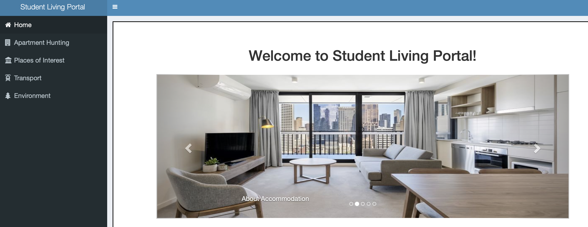

# RENTAL DASHBOARD

## 1. INTRODUCTION

The Student Living Portal is a data interface for our client The University of Melbourne. The portal is designed for 
domestic and international students who are moving to Melbourne. It is catered to a range of student values and 
living preferences. It assumes no knowledge of Melbourne and is suitable for students whose English language 
skills may not be strong. Students already living in Melbourne may also find the portal beneficial to better 
understand the city. 

Our content and design decisions were instructed by market research we conducted among Postgraduate students
who had recently moved to Melbourne. From our research, we found there were 4 primary criteria that students 
considered when looking for a place to live: Accommodation type, Places of Interest, Environment, and Transport.

## 2. DESIGN SUMMARY

### A. Use of interface

**Home Page:**

You land on the Home page where you can read about the data interface functionality.

**Apartment Hunting:**

The ’Apartment Hunting’ tab provides a live connection to domain.com via an Open API to show the latest accommodation
offerings around the City of Melbourne. There are a series of filters so a student can find the right accommodation to meet 
their budget and living preferences. If a student is interested in a property they can expand the accommodation listing and 
even apply for the accommodation immediately. Each listing also provides the feature of saving the house for future reference
and visualizing the location of the saved accommodations on other tabs for a better understanding of the area.

**Environment:**

The ’Environment’ tab contains key information for students on the physical environment and climate of the area. The Urban 
Forest layer contains information on the tree coverage around Melbourne so students can better understand the greenery of 
their surrounding environment. Students wishing to understand the climate of their area can explore the Sensor readings overlay.

**Transport:**

The ’Transport’ tab provides students with a host of information for getting around Melbourne. We have included Melbourne’s 
major public transport options including Bus, Train, and Tram. Students can make use of the transport stops and route options 
to better plan their journeys and stay connected. Those students who have access to a car may find the Street Parking overlay 
helpful.

**Place of Interests:**

Places of Interest provides markers of establishments and points of interest around Melbourne. These are categorized into a few 
relevant layers to explore such as cafes, restaurants, health, co-working spaces, etc. The tooltips include an image of the place 
(pulled from Google Places Photos API), the name, address, rating, price level, and keywords that encapsulate the services that the 
place offers.

### B. Choice of data

**Accommodation**

- Domain Group - Developer Portal API

    - Accommodation is a basic amenity that every student searches for before pursuing overseas studies. Thus, providing
       the latest accurate data is of the utmost need.
    - We also selected this API since it is provided to developers free of cost and gives accurate images, locations, and 
       different aspects of each house listed on the website.

**Environment**

- Trees, with species and dimensions (Urban Forest)
     - The student demographic values greenery for its positive impact on mental health. We found this dataset contained
        all the trees in the City of Melbourne as well as tree-specific information.
     - We found other much larger datasets with shapefiles slowed down the performance of the data interface. We decided 
        this additional information wasn’t necessary and performance decrease would not be palatable for time-poor students.

- Microclimate Sensor Readings
    - We selected this dataset as it contained key information on temperature, humidity, and wind-speed data. Students
       looking to maximize their comfort in Melbourne may find this information useful.

**Transport**

- Metro Tram Stops (AURIN), Metro Bus Stops (AURIN), Metro Train Stops (AURIN), Tram Routes (DATA VIC), Bus Routes
  (DATA VIC)
    - Understanding public transport options in the area is important for students to travel to and from uni on a budget.

- On-street Parking Bays
   - For students with access to a car this dataset provides useful information on street parking options.

**Places of Interest**

- Points of Interest - Google Places API
   - When selecting an area to reside in or explore, a student will want to consider nearby points of interest and 
      establishments. Information on addresses, type of establishment, rating, price level, and photos are all important.
   - Google Places API was best suited to this, as it provided not only detailed latitude-longitude information, but is also
      the best source for extensive and up-to-date information of establishments in a radius while being free to use within
      certain limits. We pulled data within fixed radii in the Melbourne LGA, processed and categorized them, and stored
      them in simple JSON format to add as layers.

- Coworking spaces
   - Students value working around others and the sharing of ideas. Coworking spaces are a good option for young 
      professionals seeking to network with peers and gain exposure to the working environment.

### C. Features

| Technical Feature            	| Justification                                                                                                                                                                                                                                                                                                                       	|
|------------------------------	|-------------------------------------------------------------------------------------------------------------------------------------------------------------------------------------------------------------------------------------------------------------------------------------------------------------------------------------	|
| Shiny Dashboard Plus         	| Shiny dashboard provides features that make it easy to access web application framework and create interactive platforms using R. It is open-source and easy to integrate any customization like using custom HTML, CSS files. There is flexibility for custom functions, packages and modules.                                     	|
| New Box Elements             	| Different new boxes were used for displaying the apartment listing on the apartment hunting tab. Such as social box to display the agency on top and image carousel for displaying list of images in a carousel format. This helped make the user interface clean and clear for user to understand and interact with the dashboard. 	|
| Linking tabs                 	| We added linking between tabs using the update tab section which helps make the dashboard more connected.                                                                                                                                                                                                                           	|
| Leaflet & Leaflet proxy      	| We used leaflets for all our maps to increase interactivity between the user and the displayed data. We used leaflet proxy to decrease the load on the server to load the whole map again and used leaflet proxy to add a group or layer.                                                                                           	|
| Overlay Groups in maps       	| Instead of displaying different features on different maps we chose to use overlay groups in leaflet maps which allows us to display different features together with a layer control widget to turn on/off relevant layers.                                                                                                        	|
| HTTR and JSON- Lite for APIs 	| We use different Open APIs to populate the dashboard with data. To make use of APIs we use the httr package and then to convert the response into a valid dataframe we use JSONLite which makes the work easier.                                                                                                                    	|
| Notification                 	| Warning notifications are added in the tabs when a user tries to project saved houses on maps without actually selecting any houses to inform the user about the issue so that they may not think that it isa bug in the dashboard.                                                                                                 	|

### D. Design Choices

| Visualisation Element          	| Design Choice                                                                                           	| Justification                                                                                                                                                                                                                                                                                                                                                                                                                                                                                                                                                        	|
|--------------------------------	|---------------------------------------------------------------------------------------------------------	|----------------------------------------------------------------------------------------------------------------------------------------------------------------------------------------------------------------------------------------------------------------------------------------------------------------------------------------------------------------------------------------------------------------------------------------------------------------------------------------------------------------------------------------------------------------------	|
| Dashboard Theme                	| Light colours, symbols for each tab, minimal text                                                       	| Lighter colours were selected after reviewing other popular mapping applications to provide a cleaner look and encourage greater preattentive processing of different hues in our visualisations. Maps were increased in size to cover all available space.                                                                                                                                                                                                                                                                                                          	|
| Home Page                      	| Vibrant relevant images with a guide to sections                                                        	| Clean design guided by selected stock images alongside each description for fast visual associations to each tab                                                                                                                                                                                                                                                                                                                                                                                                                                                     	|
| Apartment Hunting              	| Images allowed to take up the maximum space of each listing, minimal text, double columns               	| Images drawn from the domain.com listings and chosen as the largest element of each listing for immediate bottom-up processing as compared to listing details in text form. Double columns maximised the use of space. The layout was chosen keeping data-ink ratios in mind                                                                                                                                                                                                                                                                                         	|
| Apartment listing information  	| Use of symbols bed/bath/parking                                                                         	| “2 bedroom 2 bathroom 1 parking slot” visually condensed through a symbol set (Mackinlay’s criteria of expressiveness and effectiveness)                                                                                                                                                                                                                                                                                                                                                                                                                             	|
| Apartment listing redirection  	| Selecting an apartment links it across all map tabs                                                     	| Intuitive linking between the maps for the user’s attention to be clearly centred at the chosen apartment, while allowing them to explore multiple map views and layers linked to the same area                                                                                                                                                                                                                                                                                                                                                                      	|
| Environment: tree map layer    	| Tree map cover represented by green markers without use of clustering                                   	| Use of position/pattern as a visual variable to draw attention to areas of more clustering, this was done in accordance with Gestalt’s principle of proximity in mind. Interaction through tooltips provides additional information of every tree. Keeping the user viewpoint in mind, we allowed for the map to be panned using the cursor or arrow keys.                                                                                                                                                                                                           	|
| Environment: sensor layer      	| Markers used to represent the points at which sensor data was collected                                 	| Tooltips used to depict information collected from each sensor at the given map positions.                                                                                                                                                                                                                                                                                                                                                                                                                                                                           	|
| Transport: Bus Routes          	| Three map layers with fixed layer displaying ColorFactor coded bus routes grouped by bus number         	| Bus routes have been colour coded based on the official PTF colour scheme. Although the bus routes extended out of the Melbourne LGA, it gives the user a visually clear idea of the connectivity of their selected area to areas in and around Melbourne.                                                                                                                                                                                                                                                                                                           	|
| Transport: PTV transport stops 	| Icons displaying close by train, tram, bus stops with information                                       	| Colours and symbols used as visual variables and selected according to PTV Visual Identity Toolkit for fastest visual preprocessing through association with Maps applications and signs around Victoria. These positional visual markers aid the user in quickly identifying nearest means of public transport, with tooltips and labels for additional information. We implemented adaptive zoom and clustering as a geo-visualisation method of exploration to reduce the cognitive load from screen cluttering. This has the added benefit of faster load-times. 	|
| Transport: Parking             	| Fixed blue circles with high opacity and small size                                                     	| Clear, small circle markers help the user visually gauge general parking availability. Users can zoom into an area to locate specific parking spots. Blue selected due to parking-related semiology usually being blue.                                                                                                                                                                                                                                                                                                                                              	|
| Points of Interest             	| Clear map with layers for Cafe, Food & Drink, etc.                                                      	| Layers chosen for the viewer to quickly visualise the type of establishment they want to see. Colour chosen as a visual variable to show the rating of the establishment (< 2 = red, < 4 = yellow, 4 − 5 = green). Symbols for each category chosen and manually customised based on their type.                                                                                                                                                                                                                                                                     	|
| Points of Interest: tooltips   	| Image with heading title, star symbol rating, dollar symbol price range, address and relevant keywords. 	| Image loaded from Google Places API added for fast and interesting visual processing of the establishment. Star symbols and dollar signs used with these fields instead of plain text to mimic standard ratings on websites like Google. Place ‘Types’ from Google Places added with a search symbol for easier visual distinction, irrelevant keywords like “point of interest, establishment” removed to give the user a brief, clear idea of the particular point of interest.                                                                                    	|

## 3. SUMMARY

### A. User Story 1

**Scenario:**

Anita is an international student traveling to Australia and the City of Melbourne for the first time. She is a PHD student 
studying chemical engineering and is seeking a place to live around the university as she has to go to the university every day 
to do research in laboratories. Another challenge for Anita is finding the best transportation option to the university.

**Our data interface:**

Our interface is addressing Anita's concerns. Anita can search, compare, and find the type of accommodation that suits her 
conditions on the ”Apartment Hunting” tab. She has the option to check each accommodation facility, location, images, 
and Geographical location on the map. In addition, in the ”Transport” tab, Anita can find information about tram, bus, and train 
stations, the vehicles’ numbers, the routes using stops, and the zone number to choose the best route. Also, if Anita intends to 
use a car, the street parking locations is available in the ”Transport” tab.

### B. User Story 2

**Scenario:**

Allan is a domestic student moving to Melbourne to undertake their Masters Degree in Computer Science at the University of 
Melbourne. He has already found his accommodation in the city but wishes to understand the neighborhood better. Allan finds 
his study workload immense and spending time in nature helps him alleviate his stress levels. He also enjoys active nightlife and 
hanging out with friends in cool bars.

**Our data interface:**

Our data interface is ideal for someone like Allan. Allan will find on the ”Places of Interest” tab he can filter the overlays to select 
Food & Drink. Here he can find all the relevant bars and nightlife options near his area. Since Allan is on a budget he can identify 
more parsimonious options using the ”$” indicator on the venue pop-up. He is also able to view a picture of the establishment on 
the pop-up to get a better feel if the bar is cool enough for him. The reviews, which are color-coordinated draw his attention and 
allow him to find cheap drinks. The Shops and Supermarket Overlay may also help Allan identify his local supermarket so he can 
arrange for meals at home. Since Allan is environmentally conscious he may want to peruse the Environment tab. On the Urban 
Forest overlay Allan can discover the greenery around his area. Since Allan is still new to the city he can click the ’current location’ 
icon in the tool menu on the top-left. Allan will now be able to see all the trees in his location and plan his next nature walk. If Allan 
is inclined to learn more about the neighboring tree he can click each tree and find out additional details. Lastly, to fit Allan’s tight 
budget he can use the Transport Tab to identify his transport options for his next big night out! As a result of our Student Living Portal 
Allan is better placed to enjoy his time in Melbourne.

### 4. DESIGN SUMMARY

Our Student living portal will aid the University of Melbourne students moving to Melbourne or wishing to explore the City of Melbourne.
Students can find a place to live and better understand their area. We identified key student areas of interest and included these in our
data interface. Students using this dashboard will have an enhanced experience living in Melbourne and enjoy their studies more!
